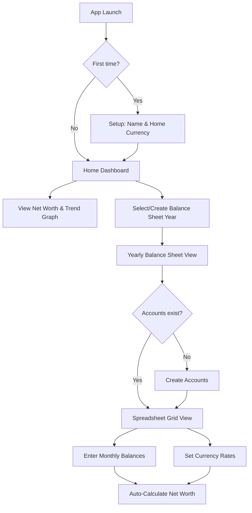
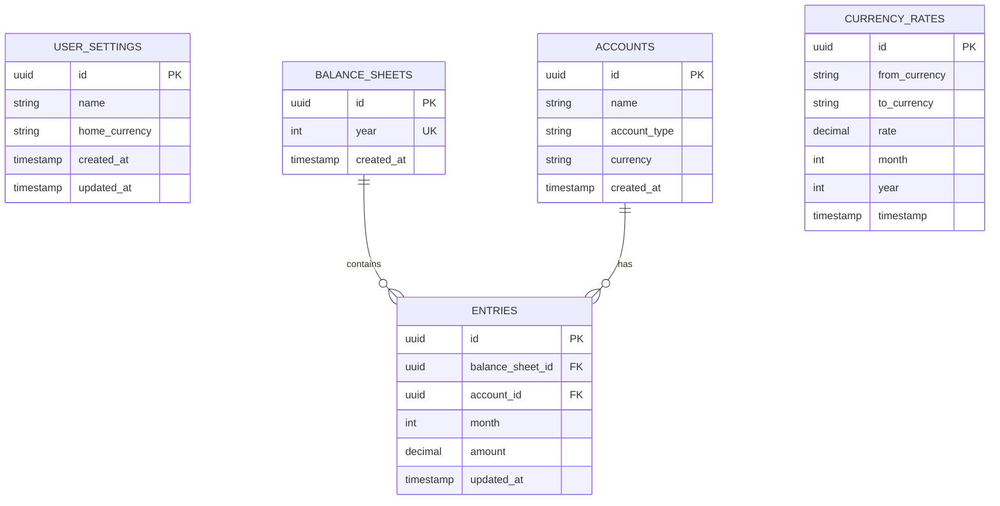

# Personal Balance Sheet App - Product Requirements Document

A Tauri desktop application to help users track their net worth through monthly balance sheets, supporting multiple currencies for expats.

---

## Overview

### Problem Statement

Users need a simple, private way to understand their personal finances month-over-month. Existing solutions are either cloud-based (privacy concerns), overly complex, or don't handle multi-currency scenarios well for expats.

### Solution

A desktop-first application that enables users to:

- Track assets and liabilities across multiple accounts
- Manage multiple currencies with conversion to a home currency
- View net worth trends over time through intuitive visualizations

---

## User Flow



---

## Core Features

### 1. User Settings

| Field         | Type     | Notes                                            |
| ------------- | -------- | ------------------------------------------------ |
| Name          | String   | User's display name                              |
| Home Currency | ISO 4217 | Primary currency for all conversions (e.g., NZD) |

- Configured on first launch
- Editable in settings

### 2. Accounts

| Field      | Type      | Notes                                           |
| ---------- | --------- | ----------------------------------------------- |
| ID         | UUID      | Primary key                                     |
| Name       | String    | User-defined (e.g., "ANZ Savings", "Visa Card") |
| Type       | Enum      | `Asset` or `Liability`                          |
| Currency   | ISO 4217  | Account's native currency                       |
| Created At | Timestamp | For ordering (oldest first)                     |

- **Global scope**: Accounts appear in ALL balance sheets once created
- **Mid-year creation**: Past months show empty (not $0)
- **No archiving** (future feature)

### 3. Balance Sheets

| Field      | Type      | Notes       |
| ---------- | --------- | ----------- |
| ID         | UUID      | Primary key |
| Year       | Integer   | e.g., 2025  |
| Created At | Timestamp |             |

- One balance sheet per year
- Cannot create duplicate years

### 4. Balance Sheet Entries

| Field            | Type      | Notes                       |
| ---------------- | --------- | --------------------------- |
| ID               | UUID      | Primary key                 |
| Balance Sheet ID | FK        | Links to balance sheet      |
| Account ID       | FK        | Links to account            |
| Month            | Integer   | 1-12                        |
| Amount           | Decimal   | Balance in account currency |
| Updated At       | Timestamp | Last edit time              |

- Entries are **always editable** (no locking)
- Historical backfilling allowed

### 5. Currency Rates

| Field         | Type     | Notes                 |
| ------------- | -------- | --------------------- |
| ID            | UUID     | Primary key           |
| From Currency | ISO 4217 | Account currency      |
| To Currency   | ISO 4217 | Home currency         |
| Rate          | Decimal  | Conversion multiplier |
| Month         | Integer  | 1-12                  |
| Year          | Integer  | e.g., 2025            |
| Timestamp     | DateTime | When rate was set     |

- **Default**: 1.0 for same-currency or new rates
- Stored per account-currency/month/year combination
- Future: Auto-fetch from public API

---

## UI Specifications

### Home Dashboard

```
┌─────────────────────────────────────────────────────┐
│  Welcome, [Name]                         ⚙️ Settings │
├─────────────────────────────────────────────────────┤
│                                                     │
│        Current Net Worth: $42,350 NZD               │
│        ▲ +$1,200 from last month                    │
│                                                     │
├─────────────────────────────────────────────────────┤
│  [1M] [3M] [6M] [YTD] [1Y] [5Y] [All]                │
│                                                     │
│  📈 Net Worth Trend Graph                           │
│  ┌─────────────────────────────────────┐            │
│  │                              ╱      │            │
│  │                         ╱───╱       │            │
│  │                    ╱───╱            │            │
│  │               ╱───╱                 │            │
│  │          ╱───╱                      │            │
│  └─────────────────────────────────────┘            │
│   Jan  Feb  Mar  Apr  May  Jun  Jul                 │
│                                                     │
├─────────────────────────────────────────────────────┤
│  Balance Sheets                                     │
│  ┌──────────┐ ┌──────────┐ ┌──────────┐             │
│  │   2025   │ │   2024   │ │  + New   │             │
│  └──────────┘ └──────────┘ └──────────┘             │
└─────────────────────────────────────────────────────┘
```

### Balance Sheet Grid (Spreadsheet Style)

```
┌────────────────────────────────────────────────────────────────────────┐
│  2025 Balance Sheet                                    [+ Add Account] │
├────────────────────────────────────────────────────────────────────────┤
│                │ Jan    │ Feb    │ Mar    │ ... │ Dec    │ Currency   │
├────────────────┼────────┼────────┼────────┼─────┼────────┼────────────┤
│ ASSETS         │        │        │        │     │        │            │
├────────────────┼────────┼────────┼────────┼─────┼────────┼────────────┤
│ ANZ Savings    │ 5,000  │ 5,200  │ 5,400  │ ... │ 6,000  │ NZD        │
│ Westpac Chq    │ 2,000  │ 2,100  │ 1,800  │ ... │ 2,500  │ NZD        │
│ CommBank AUD   │ 3,000  │ 3,100  │ 3,200  │ ... │ 3,500  │ AUD        │
│   └─ Rate      │ 1.07   │ 1.08   │ 1.06   │ ... │ 1.09   │ → NZD      │
├────────────────┼────────┼────────┼────────┼─────┼────────┼────────────┤
│ LIABILITIES    │        │        │        │     │        │            │
├────────────────┼────────┼────────┼────────┼─────┼────────┼────────────┤
│ Visa Card      │ 1,500  │ 1,200  │ 900    │ ... │ 500    │ NZD        │
├────────────────┼────────┼────────┼────────┼─────┼────────┼────────────┤
│ TOTAL ASSETS   │ 10,210 │ 10,628 │ 10,592 │ ... │ 12,315 │ NZD        │
│ TOTAL LIAB.    │ 1,500  │ 1,200  │ 900    │ ... │ 500    │ NZD        │
├────────────────┼────────┼────────┼────────┼─────┼────────┼────────────┤
│ NET WORTH      │ 8,710  │ 9,428  │ 9,692  │ ... │ 11,815 │ NZD        │
│ GROWTH         │   —    │ +718   │ +264   │ ... │ +1,200 │            │
└────────────────────────────────────────────────────────────────────────┘
```

> [!NOTE]
> Currency rates appear as sub-rows under foreign currency accounts. The grid enables inline editing by clicking any cell.

---

## Database Schema



---

## Technology Stack

| Layer      | Technology                   |
| ---------- | ---------------------------- |
| Frontend   | React 19, TypeScript, Vite   |
| Components | shadcn/ui (Radix + Tailwind) |
| Charts     | Chart.js (react-chartjs-2)   |
| Styling    | Tailwind CSS v4              |
| Backend    | Rust (Tauri 2)               |
| Database   | SQLite via sqlx              |

---

## Implementation Phases

### Phase 1: Foundation

- SQLite + sqlx setup with migrations
- Database schema creation
- Basic Tauri commands for CRUD

### Phase 2: User Onboarding

- First-launch detection
- Settings form (name, home currency)
- Settings persistence

### Phase 3: Account Management

- Account CRUD UI
- Asset/Liability type selection
- Multi-currency support

### Phase 4: Balance Sheet Core

- Year selector/creator
- Spreadsheet grid component
- Inline editing

### Phase 5: Currency Conversion

- Rate input per account/month
- Conversion calculations
- Default rate handling

### Phase 6: Dashboard & Visualization

- Net worth calculation
- Trend graph with filters
- Monthly growth display

### Phase 7: Polish

- Error handling
- Loading states
- Visual refinements

---

## Future Features Backlog

### Data Management

- [ ] **Data Export** - CSV, PDF, Excel formats for balance sheets
- [ ] **Data Import** - Bank statement parsing (CSV, OFX, QIF)
- [ ] **Data Backup/Restore** - Local backup files, cloud sync options
- [ ] **Account Archiving** - Close accounts while preserving history

### Automation

- [ ] **Auto Currency Rates** - Fetch end-of-month rates from public APIs (exchangerate-api, fixer.io)
- [ ] **Recurring Entries** - Auto-populate expected monthly balances
- [ ] **Bank Integration** - Plaid/open banking connections (privacy-optional)

### Advanced Tracking

- [ ] **Investment Tracking** - Track gains/losses, dividends, cost basis
- [ ] **Property Valuation** - Link to property value estimates
- [ ] **Debt Payoff Projections** - Visualize loan payoff timelines
- [ ] **Savings Goals** - Track progress toward specific targets

### Budgeting & Cash Flow

- [ ] **Monthly Budget** - Income vs expenses tracking
- [ ] **Cash Flow Forecasting** - Project future net worth based on trends
- [ ] **Spending Categories** - Break down where money goes

### Insights & Analysis

- [ ] **Benchmarking** - Compare growth against S&P 500, inflation
- [ ] **Milestone Celebrations** - Gamification for hitting net worth targets
- [ ] **What-If Scenarios** - Model impact of major purchases or investments
- [ ] **Tax Reporting** - Generate summaries for tax purposes

### UX Enhancements

- [ ] **Keyboard Navigation** - Arrow keys, tab between cells in grid
- [ ] **Dark Mode** - System preference detection
- [ ] **Multiple Profiles** - Track finances for household members
- [ ] **Annotations** - Add notes to specific months (major purchases, life events)
- [ ] **Mobile Companion** - Read-only mobile app for quick net worth checks
